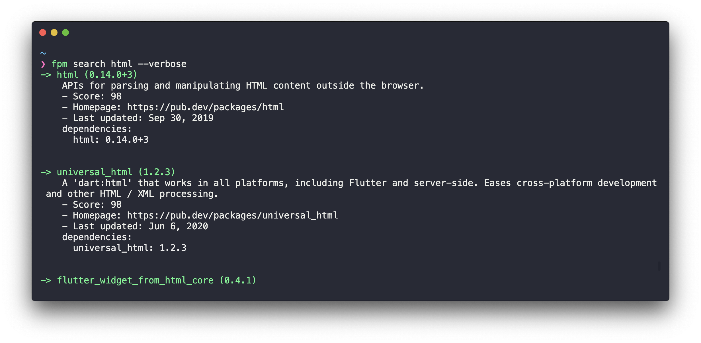
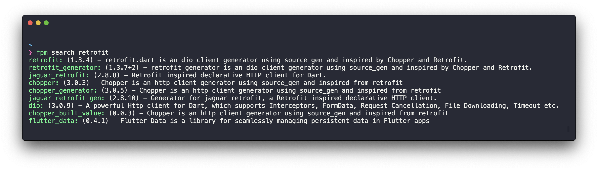

# Flutter Package Manager

<!-- 
[](https://pub.dev/help#maintenance)
[](https://pub.dev/help#health) [](https://github.com/cesarferreira/fpm/graphs/contributors) [](https://opensource.org/licenses/mit-license.php) [](https://github.com/Solido/awesome-flutter) -->

> Flutter Package Manager, powerfull package management via CLI, add/search/top/favorite packages!



<!-- **Features:**

- Lightweight
- Faster than googling -->

## Install

```bash
> pub global activate fpm
```

## Usage

Without verbose




```bash
$ fpm top
$ fpm favorites
$ fpm search html
$ fpm search html --verbose
```


```bash
# Install a specific version
$ fpm add http

# Install to dev_dependencies
$ fpm add --dev http
```


```bash
❯ fpm --help     
Flutter Version Management: A cli to manage Flutter packages.

Usage: fpm <command> [arguments]

Global options:
-h, --help       Print this usage information.
    --verbose    Print verbose output.

Available commands:
  add         Add package SDK Version
  favorites   List of the flutter favorite packages
  search      Search dart packages
  top         List the top used dart packages

Run "fpm help <command>" for more information about a command.
```